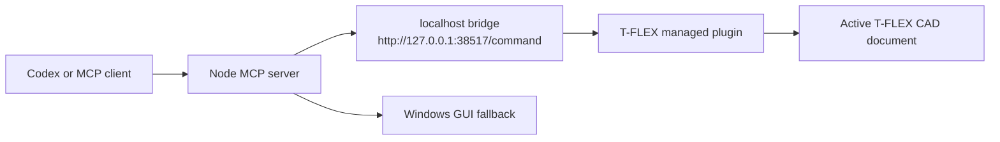

# T-FLEX Codex MCP

Local MCP tooling for controlling T-FLEX CAD from Codex or any MCP-compatible client.

[](#requirements)
[](#mcp-tools)
[](LICENSE)

T-FLEX Codex MCP connects an AI coding assistant to a running T-FLEX CAD session. It contains:

- a dependency-free Node.js MCP server;
- a managed T-FLEX plugin that exposes a localhost bridge;
- Windows GUI fallback tools for focusing windows, screenshots, clicks, hotkeys, and typing;
- install and configuration examples that keep local paths outside the repository.

## What It Can Do

- Open and inspect the active T-FLEX document.
- List, create, and update document variables.
- Rebuild, save, save as, and export documents.
- Execute short C# automation snippets inside the active T-FLEX document.
- Launch T-FLEX CAD and fall back to GUI control when API automation is not enough.

## How It Works



## Requirements

- Windows.
- T-FLEX CAD 17 or compatible installation.
- Node.js 18 or newer.
- Visual Studio or Build Tools capable of building .NET Framework 4.7.2 projects.
- Permission to copy the bridge plugin into the T-FLEX installation directory.

## Repository Layout

```text
bridge/
  BridgePlugin.cs          T-FLEX plugin entry point
  BridgeServer.cs          localhost HTTP bridge
  TflexOperations.cs       T-FLEX automation commands
  TflexCodexBridge.csproj  .NET Framework plugin project
  TflexCodexBridge.tfa     T-FLEX plugin descriptor
mcp/
  server.js                MCP server
  package.json             Node package metadata
  run-tflex-codex-mcp.cmd  Windows launcher
examples/
  codex-mcp.example.json   MCP client configuration example
install-tflex-plugin.ps1   Plugin installer
```

## Quick Start

### 1. Download the release

Download the latest `tflex-codex-mcp-release.zip` from the [GitHub Releases](https://github.com/Faserdka/tflex-codex-mcp/releases) page and extract it to a local folder.

### 2. Install the bridge plugin

Run PowerShell as Administrator if your T-FLEX installation is under `Program Files`. Navigate to the extracted folder and run:

```powershell
.\install-tflex-plugin.ps1
```

For a custom T-FLEX installation path:

```powershell
.\install-tflex-plugin.ps1 -TflexRoot "D:\Apps\T-FLEX CAD 17"
```

### 3. Start T-FLEX CAD

Launch T-FLEX CAD. The bridge plugin should auto-start and listen on:

```text
http://127.0.0.1:38517/command
```

### 4. Run the MCP server

```powershell
cd mcp
npm start
```

or:

```powershell
node .\server.js
```

### 5. Configure your MCP client

Copy `examples/codex-mcp.example.json` into your MCP client's configuration and replace:

```text
C:\Path\To\tflex-codex-mcp\mcp\server.js
```

with the absolute path on your machine.

## Building from source

If you want to build the plugin yourself instead of using the pre-compiled release:

1. Clone the repository.
2. Open `bridge/TflexCodexBridge.csproj` in Visual Studio or build it with MSBuild:

```powershell
msbuild bridge\TflexCodexBridge.csproj /p:Configuration=Release
```

If T-FLEX is installed somewhere other than the default location (`C:\Program Files\T-FLEX CAD 17\Program`), pass `TflexCadDir`:

```powershell
msbuild bridge\TflexCodexBridge.csproj /p:Configuration=Release /p:TflexCadDir="D:\Apps\T-FLEX CAD 17\Program"
```

## MCP Tools

### T-FLEX bridge tools

- `tflex_bridge_ping`
- `tflex_bridge_call`
- `tflex_active_document`
- `tflex_open_document`
- `tflex_list_variables`
- `tflex_set_variable`
- `tflex_create_variable`
- `tflex_rebuild`
- `tflex_save`
- `tflex_save_as`
- `tflex_export`
- `tflex_execute_csharp`
- `tflex_launch`

### GUI fallback tools

- `gui_list_windows`
- `gui_focus_window`
- `gui_screenshot_window`
- `gui_click`
- `gui_hotkey`
- `gui_type_text`

## Environment Variables

| Variable | Default | Description |
| --- | --- | --- |
| `TFLEX_BRIDGE_URL` | `http://127.0.0.1:38517/command` | Local bridge endpoint exposed by the T-FLEX plugin. |
| `TFLEX_MCP_TMP` | OS temp directory | Temporary folder for screenshots and helper scripts. |
| `TFLEX_EXE_PATH` | `C:\Program Files\T-FLEX CAD 17\Program\TFlexCad.exe` | Optional T-FLEX executable path used by `tflex_launch`. |

## Example Requests

Ask your MCP client:

```text
Check whether the T-FLEX bridge is running.
```

```text
List variables in the active T-FLEX document.
```

```text
Create a variable named Width with value 120 and rebuild the model.
```

```text
Export the active document as STEP to C:\Temp\part.stp.
```

## Troubleshooting

### The MCP server starts, but T-FLEX commands fail

Make sure T-FLEX CAD is running and the bridge plugin is installed. Then check:

```powershell
Invoke-RestMethod -Method Post `
  -Uri http://127.0.0.1:38517/command `
  -ContentType application/json `
  -Body '{"command":"ping","args":{}}'
```

### Visual Studio cannot find T-FLEX assemblies

Build with a custom `TflexCadDir`:

```powershell
msbuild bridge\TflexCodexBridge.csproj /p:TflexCadDir="C:\Your\T-FLEX\Program"
```

### The installer cannot write into Program Files

Run PowerShell as Administrator or install to a T-FLEX location where your user account has write permission.

## Safety Notes

The bridge listens only on `127.0.0.1`. It is intended for local automation on a trusted machine. The `tflex_execute_csharp` tool compiles and runs C# code inside the T-FLEX process, so expose this MCP server only to clients you trust.

## License

MIT. See [LICENSE](LICENSE).
